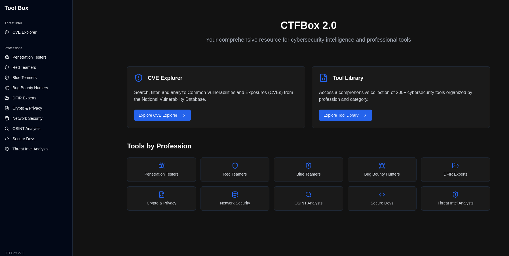

# 🧰 CTFBox – Cybersecurity Toolkit Web App

**Live URL:** [https://ctf-box2.netlify.app](https://ctf-box2.netlify.app)

CTFBox is a browser-based cybersecurity toolkit designed for ethical hackers, CTF players, red teamers, blue teamers, students, and cybersecurity enthusiasts. It provides a categorized and searchable list of 200+ world-class cybersecurity tools, helping users quickly find the right tools for reconnaissance, exploitation, malware analysis, and more.

---

## 🚀 Features

- 🔍 **Categorized Tools** – Over 200+ cybersecurity tools grouped by profession and task (e.g., recon, web exploitation, malware analysis).
- ⚡ **Blazing Fast UI** – Built with React and Tailwind CSS for a responsive, clean, and intuitive experience.
- 🔎 **Instant Search** – Search tools by name or keyword.
- 🧭 **Profession Filters** – Filter tools based on the cybersecurity role (Red Team, Blue Team, etc.).
- 🌐 **Responsive** – Fully responsive and mobile-friendly.

---

## 📸 Screenshots



---

## 🛠 Tech Stack

- **Frontend:** React.js
- **Styling:** Tailwind CSS
- **Deployment:** Netlify

---

## 📁 Folder Structure

```
ctfbox-frontend/
├── public/
├── src/
│   ├── components/       # Reusable UI components
│   ├── data/             # Tools dataset (JSON or JS)
│   ├── pages/            # Page components (e.g., Home)
│   ├── App.jsx           # Main app component
│   └── main.jsx          # Entry point
├── tailwind.config.js
└── vite.config.js
```

---

## 🧑‍💻 Contributing

Pull requests are welcome! For major changes, please open an issue first to discuss what you'd like to change.

### To contribute:

```bash
# Clone the repo
git clone https://github.com/your-username/ctfbox.git
cd ctfbox

# Install dependencies
npm install

# Start development server
npm run dev
```
---

## 🧑‍🎓 Ideal For

- CTF Players
- Ethical Hackers
- InfoSec Professionals
- Cybersecurity Students
- Red Team / Blue Team Members

---

## 🪪 License

[MIT](LICENSE)

---
> Made with ❤️ by Tanishq Nama
